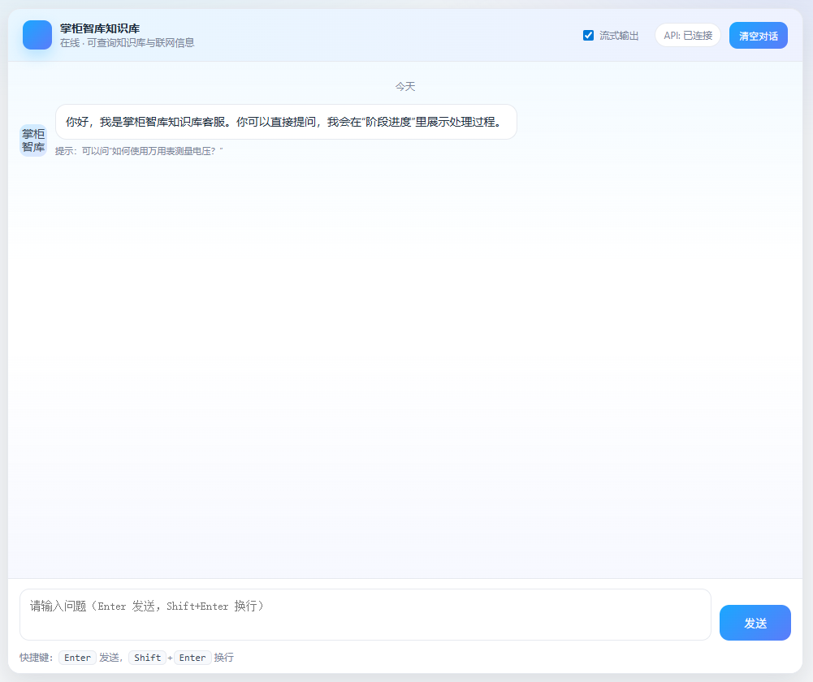
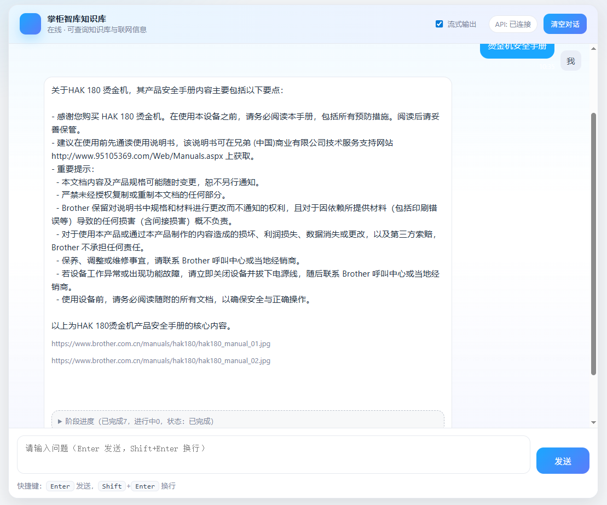
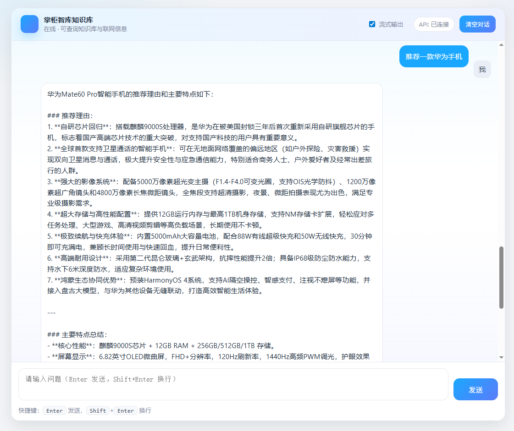
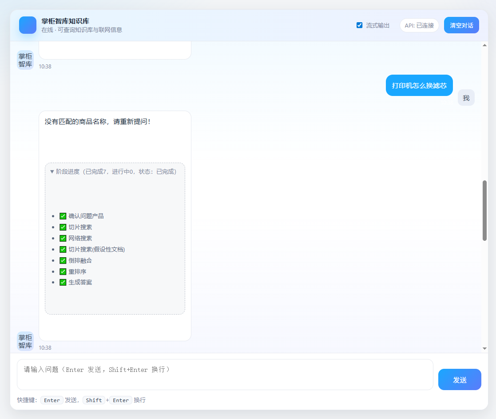
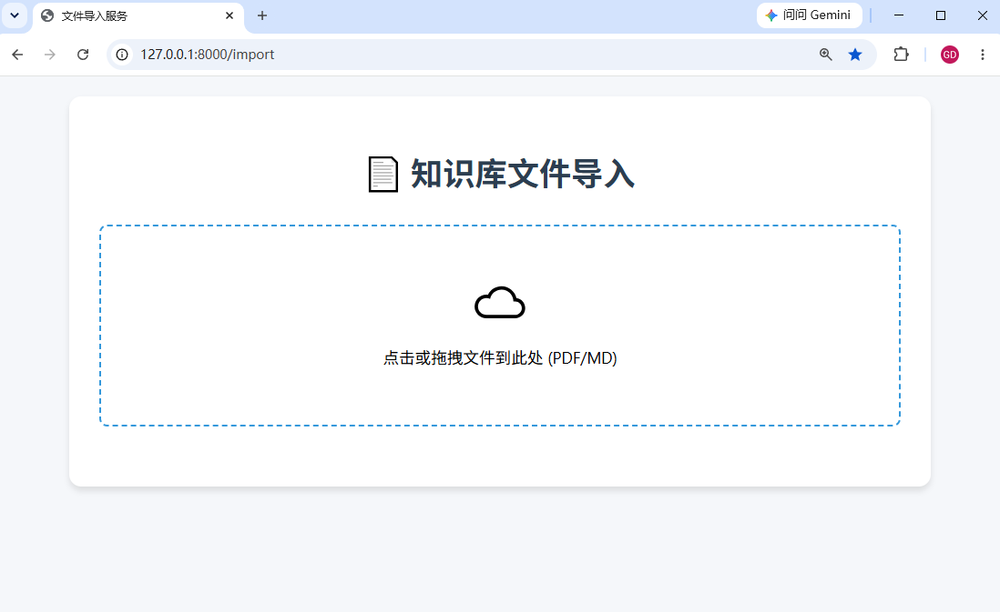
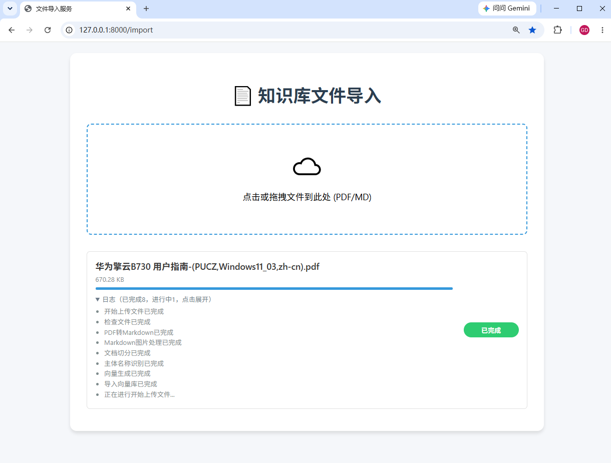
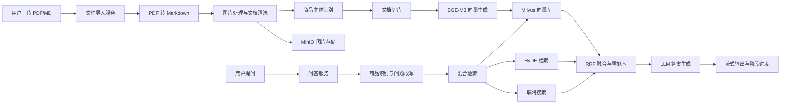

# 产品智能知识库

一个面向产品资料、说明书、安全手册、售后文档和商品知识的智能问答系统。项目支持将 PDF/Markdown 文档导入知识库，自动完成文档解析、图片处理、主体商品识别、切片、向量化与入库，并在前端提供可流式输出的产品知识问答体验。

项目当前界面名称为“掌柜智库知识库”，定位是在线产品知识助手：用户可以围绕具体商品、产品手册、使用说明、故障排查、参数对比和购买推荐进行提问，系统会结合本地知识库与可选联网检索生成回答，并展示阶段进度。

## 项目亮点

- 支持 PDF/MD 知识库文件导入，适用于产品说明书、用户指南、安全手册、售后文档等资料。
- 导入链路包含文件上传、PDF 转 Markdown、Markdown 图片处理、商品主体识别、文档切分、向量生成和向量库写入。
- 支持商品名称识别与上下文指代消解，能够将用户追问改写为包含明确商品实体的独立问题。
- 支持稠密向量与稀疏向量混合检索，提高产品文档问答的召回能力。
- 支持 HyDE 假设性文档检索、RRF 倒排融合和重排序，增强复杂问题的答案质量。
- 支持联网搜索补充信息，适合查询本地知识库之外的产品信息或公开资料。
- 支持流式回答和阶段进度展示，用户可以看到“确认问题产品、切片搜索、网络搜索、倒排融合、重排序、生成答案”等处理过程。
- 支持图片 URL 输出，适合产品结构图、接线图、说明书图片等需要图文结合的问答场景。

## 功能预览

### 智能问答首页



### 产品手册问答



### 产品推荐与联网增强



### 无匹配商品时的阶段进度



### 知识库文件导入



### 文件导入完成状态



## 功能说明

| 场景 | 说明 |
| --- | --- |
| 对话首页 | 提供产品知识库客服入口，支持 Enter 发送、Shift+Enter 换行、API 连接状态展示和清空对话。 |
| 产品手册问答 | 可围绕某个产品安全手册、用户指南或说明文档提问，返回结构化答案和相关图片链接。 |
| 产品推荐 | 可结合联网信息与知识库内容，生成产品推荐理由、核心参数和适用人群说明。 |
| 无匹配兜底 | 当本地知识库没有匹配商品时，系统会提示未匹配，并展示完整阶段进度。 |
| 文件导入 | 支持拖拽或点击上传 PDF/MD 文件，自动执行解析、切分、向量化和入库流程。 |
| 导入进度 | 导入页面展示任务进度、日志节点和完成状态，便于观察长文档处理过程。 |

## 系统架构



## 核心流程

### 知识库导入流程

1. 用户在 `/import` 页面上传 PDF 或 Markdown 文件。
2. 系统校验文件格式并创建导入任务。
3. PDF 文档经过 MinerU/Magic-PDF 能力转换为 Markdown。
4. Markdown 中的图片会被提取、上传到对象存储，并替换为可访问链接。
5. 系统根据文件名和正文切片识别商品名称或产品主体。
6. 文档被拆分为适合检索的知识切片。
7. 使用 BGE-M3 生成稠密向量和稀疏向量。
8. 切片、商品名、标题层级和向量写入 Milvus。
9. 前端展示上传、检查、图片处理、文档切分、主体识别、向量生成和入库等节点状态。

### 智能问答流程

1. 用户在聊天界面输入问题。
2. 系统结合历史会话识别用户正在询问的商品名称，并重写查询。
3. 如果识别到明确商品，会优先在对应商品知识范围内检索。
4. 系统执行稠密/稀疏混合检索，并可结合 HyDE 检索扩展召回。
5. 对多路检索结果进行 RRF 融合与重排序。
6. 若需要补充外部信息，可触发联网搜索。
7. LLM 基于知识库上下文、联网结果和历史对话生成答案。
8. 前端以流式方式输出答案，并展示每个阶段的完成情况。

## 技术栈

| 模块 | 技术 |
| --- | --- |
| Web 服务 | FastAPI、Uvicorn |
| 工作流编排 | LangGraph |
| LLM 接入 | LangChain、OpenAI-compatible API、Qwen/DashScope 等 |
| 文档解析 | MinerU / Magic-PDF |
| 向量模型 | BGE-M3、FlagEmbedding |
| 向量数据库 | Milvus |
| 图片/文件存储 | MinIO |
| 会话历史 | MongoDB / PyMongo |
| 前端页面 | HTML、CSS、JavaScript、SSE 流式通信 |
| 配置管理 | python-dotenv、`.env.example` |

## 目录结构

```text
.
├── app/
│   ├── clients/                 # Milvus、MinIO、MongoDB 等客户端封装
│   ├── conf/                    # LLM、Embedding、Milvus、MinIO 等配置
│   ├── core/                    # 日志与 Prompt 加载
│   ├── import_process/          # 文件导入服务、导入页面与导入工作流
│   ├── lm/                      # LLM、Embedding、Reranker 工具
│   ├── query_process/           # 问答服务、聊天页面与检索增强工作流
│   ├── tool/                    # 模型下载等辅助脚本
│   └── utils/                   # SSE、路径、格式化、限流等通用工具
├── docs/images/                 # README 展示截图
├── milvus/
│   └── docker-compose.yml       # Milvus/MinIO/etcd 本地部署配置
├── prompts/                     # 商品识别、问题改写、回答生成等 Prompt
├── .env.example                 # 环境变量模板，不包含真实密钥
├── pyproject.toml               # Python 项目依赖
└── README.md
```

## 快速开始

### 1. 克隆项目

```bash
git clone https://github.com/deeplearning151/Product_Intelligent_Knowledge_Base.git
cd Product_Intelligent_Knowledge_Base
```

### 2. 准备环境变量

```bash
cp .env.example .env
```

关键配置包括：

```env
OPENAI_API_KEY=
OPENAI_BASE_URL=
LLM_DEFAULT_MODEL=qwen-flash
VL_MODEL=qwen3-vl-flash
MILVUS_URL=
MINIO_ENDPOINT=localhost:9000
MINIO_ACCESS_KEY=
MINIO_SECRET_KEY=
MINIO_BUCKET_NAME=knowledge-base-files
MONGO_URL=
MONGO_DB_NAME=kb002
MINERU_API_TOKEN=
MINERU_BASE_URL=
MCP_DASHSCOPE_BASE_URL_STREAMABLE=https://dashscope.aliyuncs.com/api/v1/mcps/WebSearch/mcp
```

> 注意：`.env` 不应提交到 GitHub。项目中的 `.gitignore` 已忽略 `.env`、日志、输出目录和本地数据目录。

### 3. 安装依赖

```bash
uv sync
```

或：

```bash
pip install -e .
```

### 4. 启动 Milvus 等基础服务

```bash
cd milvus
docker compose up -d
cd ..
```

### 5. 启动文件导入服务

```bash
uvicorn app.import_process.api.import_server:app --host 0.0.0.0 --port 8000
```

访问：

```text
http://127.0.0.1:8000/import
```

### 6. 启动问答服务

```bash
uvicorn app.query_process.api.query_server:app --host 0.0.0.0 --port 8001
```

聊天页面路径以项目实际路由为准，可在 `app/query_process/page/` 中查看页面文件。

## 环境变量说明

| 变量 | 说明 |
| --- | --- |
| `OPENAI_API_KEY` | OpenAI-compatible LLM 服务密钥 |
| `OPENAI_BASE_URL` | LLM 服务基础地址 |
| `LLM_DEFAULT_MODEL` | 默认文本模型 |
| `VL_MODEL` | 默认视觉模型 |
| `BGE_M3_PATH` | 本地 BGE-M3 模型路径 |
| `BGE_DEVICE` | Embedding 运行设备，如 `cuda:0` 或 `cpu` |
| `MILVUS_URL` | Milvus 连接地址 |
| `MINIO_ENDPOINT` | MinIO 服务地址 |
| `MINIO_ACCESS_KEY` | MinIO 访问账号 |
| `MINIO_SECRET_KEY` | MinIO 访问密钥 |
| `MONGO_URL` | MongoDB 连接地址 |
| `MINERU_API_TOKEN` | MinerU 服务 Token |
| `MINERU_BASE_URL` | MinerU 服务地址 |
| `MCP_DASHSCOPE_BASE_URL_STREAMABLE` | DashScope MCP 联网搜索地址 |

## 适用场景

- 产品说明书智能问答
- 用户指南与安全手册问答
- 售后客服知识库
- 商品参数查询与推荐
- 设备故障排查辅助
- 文档图片、结构图、接线图辅助说明
- 企业内部产品资料检索系统

## 安全说明

- 不要提交 `.env`、API Key、数据库密码或私有 Token。
- 不要上传本地运行产生的 `logs/`、`output/`、`volumes/`、`milvus/volumes/` 等目录。
- 如果需要公开演示，请使用 `.env.example` 提供变量模板，真实值仅保存在本地或部署平台的环境变量中。
- 如果误提交密钥，应立即删除提交记录并在对应平台重置密钥。

## 后续优化方向

- 增加管理员后台，支持知识库文件列表、删除和重建索引。
- 增加多知识库隔离能力，支持不同产品线或租户独立检索。
- 增加引用来源高亮，展示答案对应的文档切片和页码。
- 增加图片预览组件，让答案中的产品图片可直接展开查看。
- 增加批量导入和异步任务队列，提升大规模文档处理能力。
- 增加权限控制和登录鉴权，适配企业内部知识库部署。

## License

本项目当前未指定开源许可证。如需用于商业或二次分发，请先补充明确的 License。
